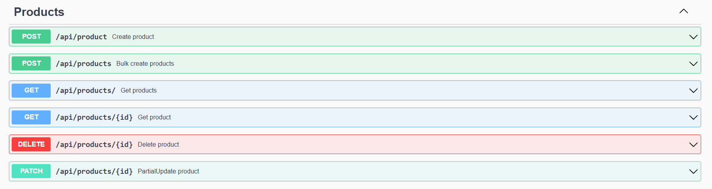

# GO template project


## Как запустить
```shell
1. Install golang
2. Create .env
3. make .bin-deps
4. Up postgres DB
5. make .build
6. make run
7. See http://localhost:3000/docs/index.html
```

## Какие есть фичи


